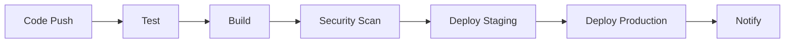

# 🚀 Etelios ERP CI/CD Pipeline Documentation

This repository contains three comprehensive CI/CD pipeline configurations for the Etelios ERP system:

## 📋 **Available CI/CD Pipelines**

### 1. **GitHub Actions CI/CD** (`.github/workflows/ci-cd.yml`)
- **Purpose**: General CI/CD pipeline for GitHub Actions
- **Features**: Testing, building, security scanning, deployment
- **Triggers**: Push to main/develop, Pull requests

### 2. **Docker CI/CD** (`.github/workflows/docker-ci-cd.yml`)
- **Purpose**: Docker-focused deployment pipeline
- **Features**: Multi-service Docker builds, Docker Compose testing, containerized deployment
- **Services**: 16 microservices with individual Docker images

### 3. **Kubernetes CI/CD** (`.github/workflows/kubernetes-ci-cd.yml`)
- **Purpose**: Kubernetes-native deployment pipeline
- **Features**: K8s manifests, Helm charts, auto-scaling, production-ready deployment
- **Infrastructure**: Full Kubernetes cluster deployment

## 🏗️ **Architecture Overview**

### **Etelios ERP Microservices (16 Services)**
```
┌─────────────────────────────────────────────────────────────┐
│                    Etelios ERP System                      │
├─────────────────────────────────────────────────────────────┤
│  🌐 auth-service (3001)     🌐 hr-service (3002)          │
│  🌐 attendance-service (3003) 🌐 payroll-service (3004)    │
│  🌐 crm-service (3005)     🌐 inventory-service (3006)    │
│  🌐 sales-service (3007)   🌐 purchase-service (3008)     │
│  🌐 financial-service (3009) 🌐 document-service (3010)   │
│  🌐 service-management (3011) 🌐 cpp-service (3012)       │
│  🌐 prescription-service (3013) 🌐 analytics-service (3014)│
│  🌐 notification-service (3015) 🌐 monitoring-service (3016)│
└─────────────────────────────────────────────────────────────┘
```

## 🔧 **Pipeline Features**

### **Testing & Quality Assurance**
- ✅ **Unit Tests**: Comprehensive test coverage
- ✅ **Integration Tests**: API endpoint testing
- ✅ **Linting**: Code quality checks
- ✅ **Coverage Reports**: Code coverage analysis
- ✅ **Security Scanning**: Trivy vulnerability scanning

### **Build & Deployment**
- ✅ **Multi-Service Builds**: 16 individual microservice builds
- ✅ **Docker Images**: Containerized applications
- ✅ **Kubernetes Manifests**: Production-ready K8s configurations
- ✅ **Auto-Scaling**: Horizontal Pod Autoscaler (HPA)
- ✅ **Health Checks**: Liveness and readiness probes

### **Environments**
- 🟡 **Staging**: Development and testing environment
- 🟢 **Production**: Live production environment
- 🔒 **Security**: Vulnerability scanning and security checks

## 📦 **Docker Configuration**

### **Docker Compose Services**
```yaml
services:
  mongodb:     # Database
  redis:       # Cache
  auth-service: # Authentication
  hr-service:   # Human Resources
  # ... 14 more microservices
```

### **Docker Images**
- **Registry**: `ghcr.io/rudrakshsingh/etelios`
- **Tags**: `latest`, `main`, `develop`, `sha-{commit}`
- **Multi-arch**: AMD64, ARM64 support

## ☸️ **Kubernetes Configuration**

### **K8s Manifests Structure**
```
k8s/
├── mongodb.yaml           # Database deployment
├── redis.yaml             # Cache deployment
├── auth-service.yaml      # Authentication service
├── hr-service.yaml        # HR service
├── attendance-service.yaml # Attendance service
├── payroll-service.yaml   # Payroll service
├── crm-service.yaml      # CRM service
├── inventory-service.yaml # Inventory service
├── sales-service.yaml    # Sales service
├── purchase-service.yaml # Purchase service
├── financial-service.yaml # Financial service
├── document-service.yaml  # Document service
├── service-management.yaml # Service management
├── cpp-service.yaml      # CPP service
├── prescription-service.yaml # Prescription service
├── analytics-service.yaml # Analytics service
├── notification-service.yaml # Notification service
├── monitoring-service.yaml # Monitoring service
└── ingress.yaml          # Ingress configuration
```

### **Kubernetes Features**
- **Namespaces**: `etelios-staging`, `etelios-production`
- **Services**: ClusterIP, LoadBalancer
- **Ingress**: Nginx ingress controller
- **Persistent Volumes**: MongoDB and Redis storage
- **Secrets**: JWT tokens, database credentials
- **ConfigMaps**: Environment configurations

## 🚀 **Deployment Process**

### **1. GitHub Actions Pipeline**


### **2. Docker Deployment**
```bash
# Build all services
docker-compose build

# Deploy to staging
docker-compose -f docker-compose.yml up -d

# Deploy to production
docker-compose -f docker-compose.production.yml up -d
```

### **3. Kubernetes Deployment**
```bash
# Deploy to staging
kubectl apply -f k8s/ -n etelios-staging

# Deploy to production
kubectl apply -f k8s/ -n etelios-production

# Check deployment status
kubectl get pods -n etelios-production
```

## 🔐 **Security Features**

### **Container Security**
- ✅ **Vulnerability Scanning**: Trivy security scans
- ✅ **Image Signing**: Signed container images
- ✅ **Base Image Updates**: Regular security updates
- ✅ **Non-root User**: Security-hardened containers

### **Kubernetes Security**
- ✅ **RBAC**: Role-based access control
- ✅ **Network Policies**: Pod-to-pod communication
- ✅ **Secrets Management**: Encrypted secrets
- ✅ **Pod Security Standards**: Restricted security context

## 📊 **Monitoring & Observability**

### **Health Checks**
- **Liveness Probes**: Container health monitoring
- **Readiness Probes**: Service availability checks
- **Startup Probes**: Initial startup validation

### **Metrics & Logging**
- **Application Metrics**: Custom business metrics
- **Infrastructure Metrics**: CPU, memory, disk usage
- **Log Aggregation**: Centralized logging
- **Alerting**: Proactive issue detection

## 🛠️ **Setup Instructions**

### **Prerequisites**
- GitHub repository with Actions enabled
- Docker and Docker Compose
- Kubernetes cluster (for K8s deployment)
- kubectl configured

### **Environment Variables**
```bash
# Required secrets in GitHub
GITHUB_TOKEN=your_github_token
KUBE_CONFIG=base64_encoded_kubeconfig
MONGO_URI=mongodb://localhost:27017/hrms
REDIS_HOST=localhost
JWT_SECRET=your_jwt_secret
JWT_REFRESH_SECRET=your_refresh_secret
```

### **Quick Start**
1. **Fork/Clone** this repository
2. **Configure** environment variables
3. **Push** to trigger CI/CD pipeline
4. **Monitor** deployment progress
5. **Access** services via provided URLs

## 📈 **Performance & Scaling**

### **Auto-Scaling Configuration**
- **HPA**: Horizontal Pod Autoscaler
- **VPA**: Vertical Pod Autoscaler
- **Resource Limits**: CPU and memory constraints
- **Load Balancing**: Service mesh integration

### **High Availability**
- **Multi-replica**: 2+ replicas per service
- **Health Checks**: Automatic failover
- **Load Balancing**: Traffic distribution
- **Disaster Recovery**: Backup and restore

## 🎯 **Next Steps**

1. **Configure** your Kubernetes cluster
2. **Set up** monitoring and logging
3. **Implement** backup strategies
4. **Configure** SSL/TLS certificates
5. **Set up** domain and DNS
6. **Implement** CI/CD best practices

## 📞 **Support**

For questions or issues:
- **GitHub Issues**: Create an issue in this repository
- **Documentation**: Check the comprehensive guides
- **Community**: Join our developer community

---

**🎉 Etelios ERP is now ready for production deployment with enterprise-grade CI/CD pipelines!**
